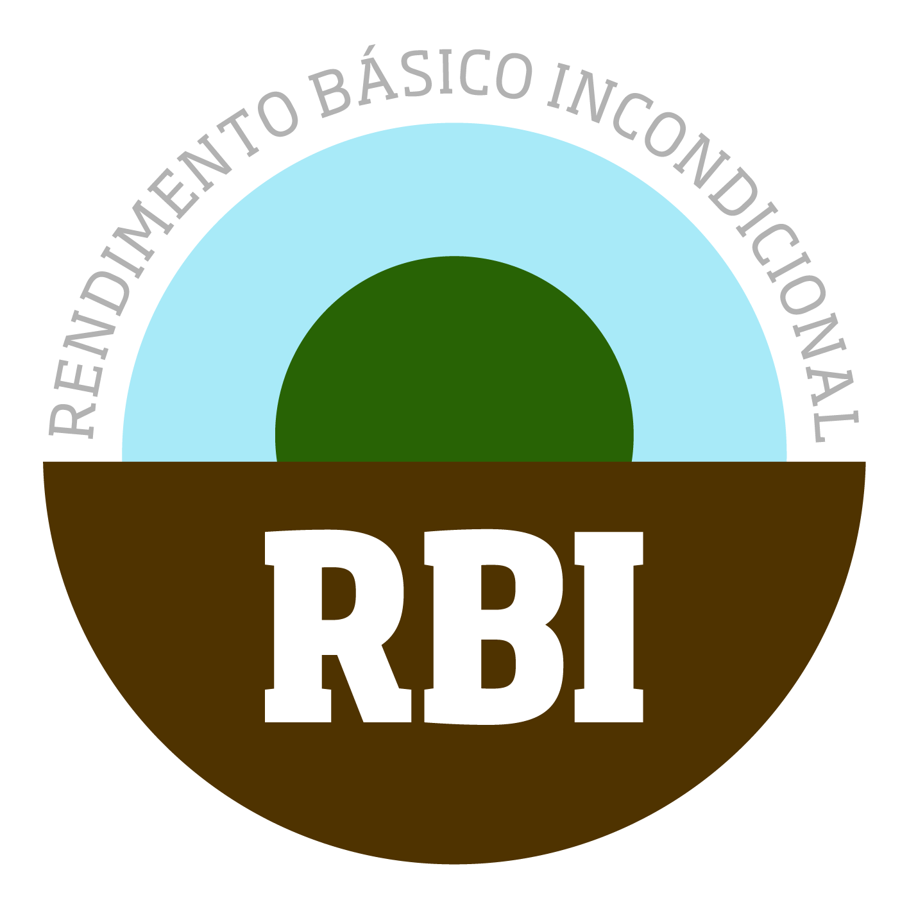

## O que é

O Rendimento Básico Incondicional é uma prestação atribuída a cada cidadão,
independentemente da sua situação financeira, familiar ou profissional,
e suficiente para permitir uma vida com dignidade. 

Um RBI é **incondicional** em três sentidos principais:

1. **Universal** - não discrimina ninguém, aplica-se a todos.
2. **Livre de obrigações** - um direito para todos, sem burocracias nem requisitos a cumprir.
3. **Individual** - garante autonomia às pessoas em situação vulnerável independentemente da situação familiar.

Idealmente, um RBI deve ser **suficiente** para viver com dignidade.
A quantia deve ser suficiente para garantir condições de vida decentes, que estejam de acordo com os padrões sociais e culturais do país em questão.
Deve prevenir a pobreza material e garantir a oportunidade de participar na sociedade.
Isto significa que o rendimento líquido deverá, no mínimo, estar ao nível de risco de pobreza de acordo com os padrões europeus,
o que corresponde a 60% do denominado rendimento mediano por adulto equivalente.
Especialmente em países nos quais a maioria aufira de rendimentos reduzidos, e em que por consequência o rendimento médio seja reduzido,
um índice de referência alternativo (um cabaz de bens, por exemplo) deve ser usado para determinar o valor do rendimento básico,
de modo a que este garanta uma vida com dignidade, segurança material e participação plena na sociedade.
 
**O objetivo deste site é informar e promover a discussão sobre o rendimento básico incondicional em Portugal,
para que possam ser encontradas as melhores formas de organizar e implementar este sistema.**

## Porquê um RBI?

Como resultado dos atuais padrões de emprego e de sistemas de apoio ao rendimento inadequados
(condicionais, dependentes da avaliação dos serviços estatais, não suficientemente elevados),
julgamos essencial a introdução do Rendimento Básico Incondicional de modo a garantir os direitos fundamentais, especialmente a uma vida com dignidade,
como enunciados na Carta dos Direitos Fundamentais da União Europeia.

Acima de tudo, o Rendimento Básico incondicional ajudará a prevenir a pobreza
e a assegurar a liberdade a cada indivíduo a determinar a sua vida,
e a fortalecer a participação de todos na sociedade.

O Rendimento Básico incondicional ajudará a evitar divisões sociais, debates baseados na inveja e na injúria e as suas consequências,
assim como uma burocracia de controlo e inspeção superfluamente dispendiosa, repressiva e excludente.
Enquanto pagamento por transferência livre de discriminação e estigmatização, o Rendimento Básico incondicional previne a pobreza oculta e diferentes tipos de doença.

O Rendimento Básico incondicional gera liberdade social, ajuda os cidadãos a identificarem-se com a União Europeia e garante os seus direitos políticos.
Favorece a concretização dos direitos fundamentais.
“A dignidade do ser humano constitui não só um direito fundamental em si mesma, mas também a própria base dos direitos fundamentais.”
(Texto das anotações relativas ao texto integral da Carta dos Direitos Fundamentais da União Europeia).

A introdução do Rendimento Básico incondicional e possíveis disposições introdutórias
fazem parte das respetivas áreas de responsabilidade dos Estados Membros da União Europeia.

## Saber mais sobre o Rendimento Básico

Na página **[bibliografia](pages/bibliografia)** poderá encontrar livros, ensaios, relatórios de estudos e artigos académicos sobre o rendimento básico.

Se preferir vídeo, pode assistir ao documentário "[O Rendimento Básico](http://www.youtube.com/watch?v=ExRs75isitw)" (2008),
que explica a justificação económica, ética e histórica para a implementação de um rendimento básico.
Contém testemunhos de cidadãos comuns e de economistas, sociólogos e outros especialistas,
e apresenta cálculos, gráficos, estatísticas e simulações que revelam a viabilidade, simplicidade e a lógica dessa proposta.

O vídeo com legendas em português pode ser visualizado abaixo.
Pode também fazer [download do vídeo](http://rendimentobasico.pt/grundeinkommen.zip) (600 MB)
para acesso offline, exibição, etc.

Para mais informações sobre o rendimento básico, pode consultar:

* Basic Income Earth Network: http://www.basicincome.org
* Global Income Foundation: http://www.globalincome.org/
* Wikipedia: https://en.wikipedia.org/wiki/Basic_income 

**Como apoiar**: Assine a [petição nacional](http://peticaopublica.com/pview.aspx?pi=PT71674)
e divulgue o link aos seus amigos e conhecidos.
